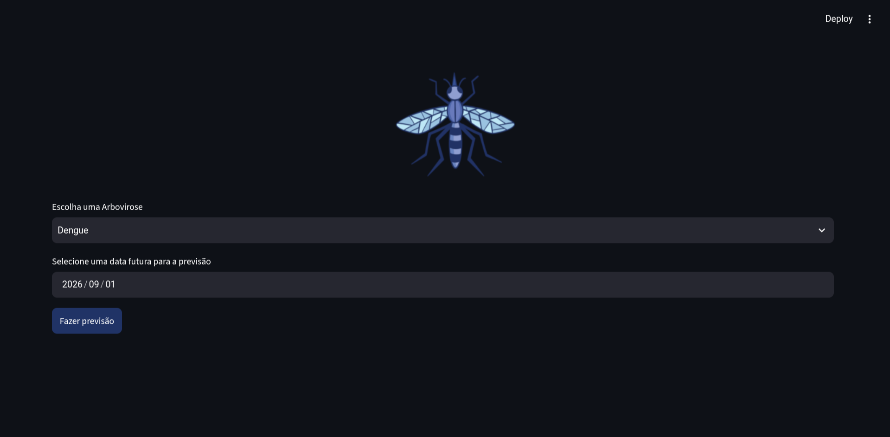
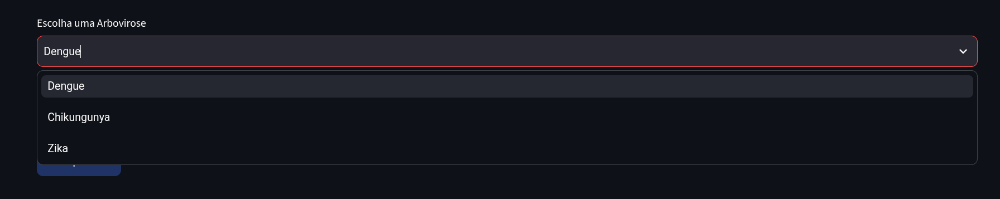
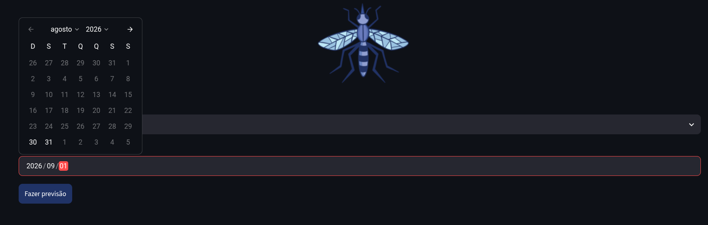
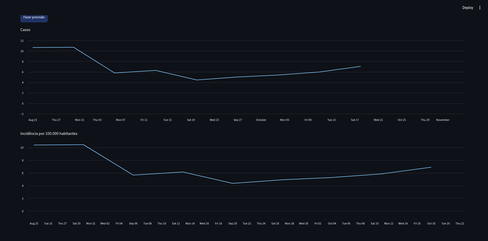

# TCC-interface-de-visualizacao-de-arboviroses
## Introdução

A fim de permitir a avaliação dos resultados obtidos, foi criado também um sistema de avaliação simples para ser apresentado aos integrantes do CIEVS-SAJ. O sistema foi desenvolvido com a linguagem Python e o framework *Streamlit*. Todos os modelos foram salvos em arquivos *.pkl*, tipo comum de arquivo usado para salvar modelos de inteligência artificial, onde irão ser usados no sistema web. Os mesmos foram treinados com todos os dados disponíveis nos seus respectivos conjuntos de dados.

O modelo preditivo escolhido para ser usado no sistema foi o SARIMAX treinado ao longo deste trabalho. A escolha do modelo se deu por o mesmo apresentar a melhor relação custo-benefício entre todos os modelos treinados nesta pesquisa, ou seja, suas métricas foram superiores na maioria dos casos das 03 arboviroses. Além disso, decidimos seguir com apenas um modelo prezando a facilidade de uso, pois dar essa opção ao usuário iria trazer uma complexidade ao uso à ferramenta que não seria interessante para usuários não técnicos do CIEVS-SAJ.

A aplicação permite que usuários consultem previsões de casos de Dengue, Chikungunya e Zika, facilitando o uso do modelo no cotidiano das atividades de vigilância epidemiológica. Para o referido sistema conta com os seguintes requisitos funcionais:

- Seleção da arbovirose (Dengue, Chikungunya, Zika)
- Seleção de data futura para previsão
- Visualização gráfica da previsão
- Limitação de data mínima por arbovirose (Uma semana após o último dado de treinamento)
- Cálculo de incidência por 100 mil habitantes, usando população fixa atual, também com visualização gráfica.

A avaliação foi realizada com profissionais do CIEVS-SAJ por meio da aplicação de um questionário, destinado a coletar *feedbacks* sobre a ferramenta. Serão considerados aspectos relacionados à usabilidade, utilidade e aplicabilidade do sistema no contexto da vigilância epidemiológica. Os resultados obtidos permitirão identificar pontos positivos, limitações e sugestões de aprimoramento, contribuindo para analisar a viabilidade da solução como apoio ao monitoramento e à tomada de decisão em relação às arboviroses.

## Sistema Web

A seguir, um passo a passo simples de como utilizar o sistema.

*Figure: Sistema de avaliação - Tela geral 2026*

Na figura acima é mostrada a interface principal do sistema, nele há o *checkbox* de seleção de arbovirose e um *input* para a seleção da data de previsão futura. Abaixo deles o botão de *"Fazer Previsão"* onde o usuário pode fazer a predição, que aparecerá nos gráficos abaixo.

*Figure: Sistema de avaliação - Seleção de arbovirose 2026*

*Figure: Sistema de avaliação - Seleção da data de previsão 2026*

*Figure: Sistema de avaliação - Resultados em gráficos 2026*

Na figura acima são mostrados os gráficos de casos e incidência por 100.000 habitantes da janela de previsão selecionada pelo usuário.

## Instruções
Na pasta *dados* ficam os datasets do projeto incluido a planilia de avaliação do *CIEVS-SAJ*.
Já em *gráficos* ficam as figuras de gráficos dos dados, usados no projeto.
Em *modelos* ficam os modelos SARIMAX usados no sistema web no formato .pkl.
*sistema_de_avaliacao.py* é o arquivo principal do sistema que deve ser rodado com o seguinte comando no terminal: "streamlit run sistema_de_avaliacao.py".

